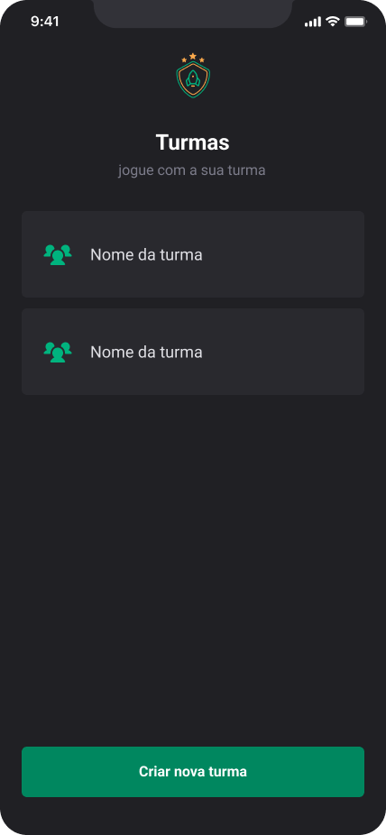

## Projeto: Ignite Teams

# Ignite Teams

Projeto desenvolvido com base nas aulas do professor Rodrigo Gonçalves, da Rocketseat, durante a trilha de React Native do programa Ignite.

A proposta do app é gerenciar **grupos e participantes de atividades (como jogos)**, onde cada grupo possui seus próprios jogadores.

---

## Tecnologias Utilizadas

- [React Native](https://reactnative.dev/)
- [TypeScript](https://www.typescriptlang.org/)
- [Expo](https://expo.dev/)
- [AsyncStorage](https://docs.expo.dev/versions/latest/sdk/async-storage/)
- [React Navigation](https://reactnavigation.org/)
- [Styled Components](https://styled-components.com/)

---

## Screenshots

| Nova Turma | Turmas | Nome da Turma |
|---------------|--------------------|------------------|
|  |  |  |

---

## Funcionalidades

- Criar novos grupos
- Adicionar e remover participantes
- Filtrar participantes por time
- Armazenar dados localmente com AsyncStorage
- Validação de entrada e feedbacks com Alertas

---

## Instalação

1. Instale as dependências:

   ```bash
   npm install
   # ou
   yarn install
   ```

## Executando o Projeto

1. Inicie o servidor de desenvolvimento:

   ```bash
   npm start
   # ou
   yarn start
   ```